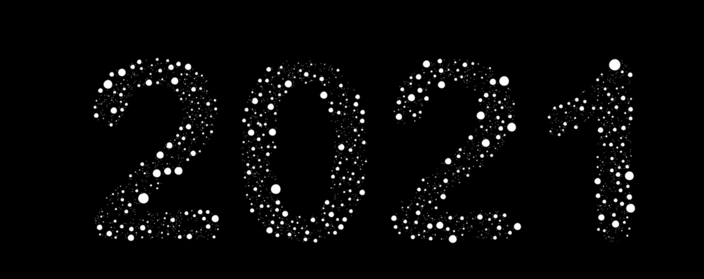

# yche6735_9103_tut8

# Week 8 quiz
## Part 1: Imaging Technique Inspiration
- Imaging Technique
  - **Circle packing**: Circle Packing is a technique in which multiple circles are closely packed to fill a given area, showing each circle without overlap. This approach is particularly popular in art design and information graphics, enabling the representation of hierarchical structures or quantitative relationships in highly attractive ways.
- Aspects that can be merged
  - **Seamless filling** : I think the seamless filling feature of circle packing is great for composing images. It can enhance visual continuity and make my work more visually compact and unified.
  - **Visual hierarchy** : You can design circles of different sizes to reflect the importance or categories of different parts of the project and increase the hierarchy of the picture, such as highlighting the key points with large circles and so on.
- Screenshots or Images

  - 1.
  - 2.

## Part 2: Coding Technique Exploration
- Coding Technique: **Circle Packing Algorithm**

Iterative and simulated annealing algorithms are used to help optimize the position and size of the circles, ensuring that they are closely and non-overlapping filled in a region.

With this technique, I want to use it to fill fixed images or text. Circles automatically generate random sizes within a fixed area and stop growing when they touch other circles, resulting in beautiful patterns that vary in size but are compact.

- code example:
[link](https://editor.p5js.org/codingtrain/sketches/wxGRAd4I-)